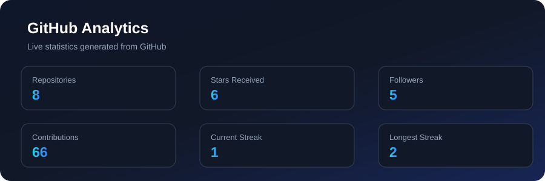
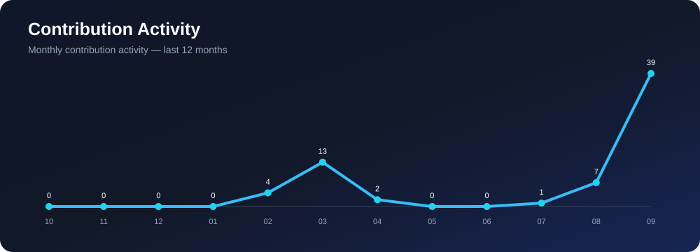
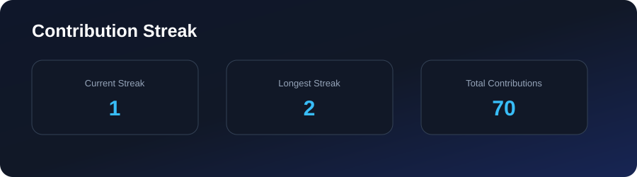
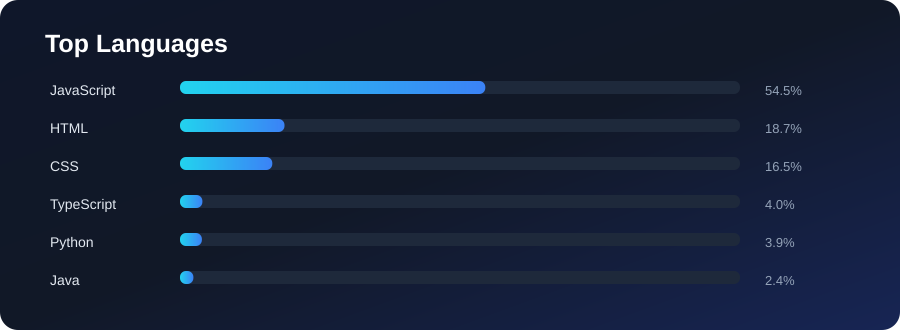

<!-- ========================================================= -->
<!--                    SANGSAPTAK DAS                         -->
<!--                 GITHUB PROFILE README                     -->
<!-- ========================================================= -->

<!-- HERO -->

 

  

---

## 👋 Hello, I'm Sangsaptak Das

### 🤖 AI/ML Developer • 💻 Full-Stack Developer • 🚀 Problem Solver

I build intelligent, practical and user-focused applications by combining
<strong>Artificial Intelligence, Machine Learning and modern web technologies.</strong>

🎓 Computer Science & Engineering (AI/ML) Student &nbsp;•&nbsp;
🇮🇳 India &nbsp;•&nbsp;
💡 Always curious, always building

---

# 🧠 About Me

<table>
<tr>
<td width="50%" valign="top">

### 🚀 What I Do

- 🤖 Build AI & Machine Learning applications
- 🌐 Develop full-stack web applications
- 🐍 Work with Python for intelligent solutions
- 🧩 Solve programming & algorithmic problems
- 🔗 Build and integrate APIs
- ☁️ Explore deployment & cloud technologies
- 🛠️ Turn ideas into working products

</td>

<td width="50%" valign="top">

### 🎯 Current Focus

- 🧠 Artificial Intelligence
- 🤖 Machine Learning
- 🔥 Deep Learning
- 🌐 Full-Stack Development
- 👁️ Computer Vision
- 📊 Data & Analytics
- 🚀 Real-world project development

</td>
</tr>
</table>

---

# 🔭 What I'm Working On

### 🤖 KriyaSense-AI

**An AI-powered project focused on intelligent activity recognition and real-world automation.**

---

# 🛠️ Technology Stack

### 💻 Languages

  

### 🌐 Frontend

  

### ⚙️ Backend

  

### 🤖 AI / Machine Learning

  

### 🗄️ Databases

  

### ☁️ Tools & Platforms

---

# 🚀 Featured Projects

<table>
<tr>

<td width="50%" valign="top">

## 🤖 KriyaSense-AI

AI/ML project focused on intelligent activity recognition and real-world applications.

**Focus:** AI • ML • Computer Vision

</td>

<td width="50%" valign="top">

## 🌍 AtmosBridge

Technology-driven project exploring intelligent solutions around environmental and atmospheric data.

**Focus:** AI • Data • Web

</td>

</tr>

<tr>

<td width="50%" valign="top">

## 📊 Algorithm Visualizer

Interactive project designed to make algorithms easier to understand through visualization.

**Focus:** Algorithms • Visualization • Programming

</td>

<td width="50%" valign="top">

## 🌐 My Portfolio

Personal portfolio showcasing projects, skills and development work.

**Focus:** Web Development • UI • Portfolio

</td>

</tr>
</table>

---

---

---

# 📊 GitHub Analytics

---

# 📈 Contribution Activity

---

---

# 🐍 Contribution Snake

<picture>
  <source media="(prefers-color-scheme: dark)"
          srcset="https://raw.githubusercontent.com/sangsaptak0704/sangsaptak0704/output/github-contribution-grid-snake-dark.svg">

  <source media="(prefers-color-scheme: light)"
          srcset="https://raw.githubusercontent.com/sangsaptak0704/sangsaptak0704/output/github-contribution-grid-snake.svg">

  
</picture>

---

# 🔥 Contribution Streak

---

# 🧑‍💻 Top Languages

# 🐍 Contribution Snake

# 📌 GitHub Highlights

<table>
<tr>

<td align="center">

### 📦 Repositories

</td>

<td align="center">

### ⭐ Stars

</td>

<td align="center">

### 👥 Followers

</td>

</tr>
</table>

---

# 🧩 What I Enjoy Building

| 🤖 Artificial Intelligence | 🌐 Full-Stack Applications |
| :---: | :---: |
| Machine Learning | Frontend Development |
| Deep Learning | Backend Development |
| Computer Vision | REST APIs |
| Intelligent Automation | Database Systems |

---

# 📚 Currently Learning

`Artificial Intelligence` • `Machine Learning` • `Deep Learning`

`Computer Vision` • `Full-Stack Development` • `Cloud Technologies`

---

# ⚡ Fun Fact

> 🤖 **I teach machines to learn, while I'm still learning how to debug my own code.** 😄

---

# 🌐 Connect With Me

---

# 💭 Developer Mindset

### **Build. Learn. Break. Fix. Repeat. 🚀**

*"The best way to predict the future is to create it."*

---

### ⭐ Thanks for visiting my profile!

**If you find my projects interesting, consider giving them a ⭐**

