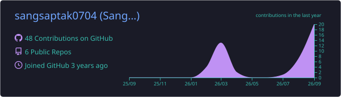
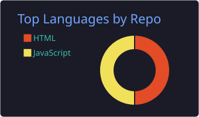
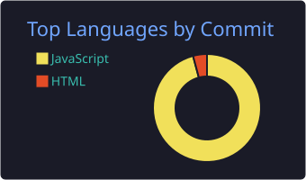
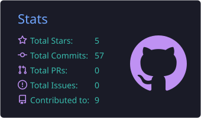
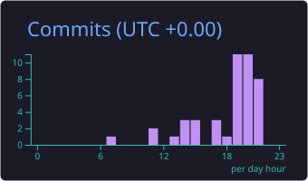

<!-- ═══════════════════════════════════════════════════════════════════════ -->
<!--                            TOP BANNER                                  -->
<!-- ═══════════════════════════════════════════════════════════════════════ -->

<!-- ═══════════════════════════════════════════════════════════════════════ -->
<!--                              HEADER                                    -->
<!-- ═══════════════════════════════════════════════════════════════════════ -->

  <h1>
    👋 Hi, I'm Sangsaptak Das
  </h1>

  

    <b>AI/ML Developer • Full-Stack Developer • Computer Science Student</b>
  

<!-- ═══════════════════════════════════════════════════════════════════════ -->
<!--                         TYPING ANIMATION                                -->
<!-- ═══════════════════════════════════════════════════════════════════════ -->

  

<!-- ═══════════════════════════════════════════════════════════════════════ -->
<!--                     PROFILE VIEWS + FOLLOWERS                           -->
<!-- ═══════════════════════════════════════════════════════════════════════ -->

  

  &nbsp;

  

  &nbsp;

  

 

<!-- ═══════════════════════════════════════════════════════════════════════ -->
<!--                        3D CONTRIBUTION MAP                              -->
<!-- ═══════════════════════════════════════════════════════════════════════ -->

  

 

<!-- ═══════════════════════════════════════════════════════════════════════ -->
<!--                              ABOUT ME                                   -->
<!-- ═══════════════════════════════════════════════════════════════════════ -->

<h2 align="left">

  

  &nbsp;<b>About Me</b>

</h2>

I'm Sangsaptak Das, a Computer Science & Engineering student specializing in Artificial Intelligence and Machine Learning. I enjoy learning by building real-world applications and experimenting with AI, machine learning, backend systems, and modern web technologies.

My goal is to transform ideas into useful, practical, and deployable software while continuously improving my problem-solving and development skills.

 

<table align="center">

<tr>

<td valign="top" width="50%">

### 🎓 Education

&nbsp;&nbsp;B.Tech, Computer Science & Engineering  
&nbsp;&nbsp;Artificial Intelligence & Machine Learning

### 📍 Location

&nbsp;&nbsp;India

### ✉️ Contact

&nbsp;&nbsp;[sangsaptakdas55@gmail.com](mailto:sangsaptakdas55@gmail.com)

</td>

<td valign="top" width="50%">

### 🧭 What I Do

&nbsp;&nbsp;🤖 Artificial Intelligence & Machine Learning

&nbsp;&nbsp;🐍 Python Development

&nbsp;&nbsp;🌐 Full-Stack Development

&nbsp;&nbsp;⚙️ Backend Development

&nbsp;&nbsp;📊 Data & Algorithm Visualization

</td>

</tr>

</table>

 

<!-- ═══════════════════════════════════════════════════════════════════════ -->
<!--                       CURRENTLY WORKING ON                              -->
<!-- ═══════════════════════════════════════════════════════════════════════ -->

#### 🚀 Currently Working On

- 🤖 **KriyaSense** — an offline AI assistant for validating experiment protocols
- 🎥 **OpenMeet** — a modern web-based video meeting platform
- 📊 **Algorithm Visualizer** — interactive visualization of algorithms
- 🌐 **Personal Portfolio** — continuously improving my developer portfolio
- 🧠 Strengthening **AI/ML, DSA and Full-Stack Development**
- 🚀 Building and deploying real-world software projects

#### 💡 Interests

  

  

  

  

  

  

  

#### 🛠️ Where I'm Strongest

| | |
|---|---|
| 🐍 **Python & AI/ML** | Machine learning, automation, data processing and backend development |
| ☕ **Java** | Object-oriented programming, DSA and application development |
| 🌐 **Web Development** | Frontend and backend development for real-world applications |
| 🧠 **AI & Computer Vision** | Building intelligent systems and AI-powered applications |
| 🗄️ **Databases** | Working with SQL and application data management |
| 🔧 **Git & GitHub** | Version control, collaboration and project deployment |

> *"I believe in learning by building 🏗️ — turning ideas into functional, real-world solutions."*

#### 🎯 Outside of Code

💻 Side Projects &nbsp;·&nbsp; 🤖 AI Experiments &nbsp;·&nbsp; 🎨 UI/UX &nbsp;·&nbsp; 🧠 Problem Solving &nbsp;·&nbsp; 🚀 Exploring New Technologies

<!-- ═══════════════════════════════════════════════════════════════════════ -->
<!--                          QUICK CONTACT                                  -->
<!-- ═══════════════════════════════════════════════════════════════════════ -->

  

  &nbsp;

  

  &nbsp;

  

  &nbsp;

  

  &nbsp;

  

 

<!-- ═══════════════════════════════════════════════════════════════════════ -->
<!--                         TECHNOLOGY STACK                                -->
<!-- ═══════════════════════════════════════════════════════════════════════ -->

<h2 align="left">

  ⚙️ &nbsp;<b>Technology Stack</b>

</h2>

<h3 align="left">

  🗣️ &nbsp;<b>Languages</b>

</h3>

  

<h3 align="left">

  🛠️ &nbsp;<b>Frameworks & Libraries</b>

</h3>

  

  

  

  

  

<h3 align="left">

  🗄️ &nbsp;<b>Databases</b>

</h3>

  

<h3 align="left">

  ☁️ &nbsp;<b>Cloud & Development Tools</b>

</h3>

  

<h3 align="left">

  🤖 &nbsp;<b>AI / Developer Tools</b>

</h3>

  

  

  

 

<!-- ═══════════════════════════════════════════════════════════════════════ -->
<!--                         GITHUB STATISTICS                               -->
<!-- ═══════════════════════════════════════════════════════════════════════ -->

<h2 align="left">

  📊 &nbsp;<b>GitHub Statistics</b>

</h2>

<!-- ═══════════════════════════════════════════════════════════════════════ -->
<!--                      PROFILE SUMMARY CARDS                              -->
<!-- ═══════════════════════════════════════════════════════════════════════ -->

  

 

  

  

 

  

  

 

<!-- ═══════════════════════════════════════════════════════════════════════ -->
<!--                         GITHUB STATS                                    -->
<!-- ═══════════════════════════════════════════════════════════════════════ -->

  

  &nbsp;

  

 

<!-- ═══════════════════════════════════════════════════════════════════════ -->
<!--                         CONTRIBUTION STREAK                             -->
<!-- ═══════════════════════════════════════════════════════════════════════ -->

  

 

<!-- ═══════════════════════════════════════════════════════════════════════ -->
<!--                              TROPHIES                                   -->
<!-- ═══════════════════════════════════════════════════════════════════════ -->

<h2 align="left">

  🏆 &nbsp;<b>GitHub Trophies</b>

</h2>

  

 

<!-- ═══════════════════════════════════════════════════════════════════════ -->
<!--                         CONTRIBUTION SNAKE                              -->
<!-- ═══════════════════════════════════════════════════════════════════════ -->

<h2 align="left">

  🐍 &nbsp;<b>Contribution Snake</b>

</h2>

  <picture>

    <source
      media="(prefers-color-scheme: dark)"
      srcset="https://raw.githubusercontent.com/sangsaptak0704/sangsaptak0704/output/github-contribution-grid-snake-dark.svg"
    />

    <source
      media="(prefers-color-scheme: light)"
      srcset="https://raw.githubusercontent.com/sangsaptak0704/sangsaptak0704/output/github-contribution-grid-snake.svg"
    />

    

  </picture>

 

<!-- ═══════════════════════════════════════════════════════════════════════ -->
<!--                         FEATURED PROJECTS                               -->
<!-- ═══════════════════════════════════════════════════════════════════════ -->

<h2 align="left">

  🚀 &nbsp;<b>Featured Projects</b>

</h2>

  

  &nbsp;

  

 

  

  &nbsp;

  

 

<!-- ═══════════════════════════════════════════════════════════════════════ -->
<!--                           CONNECT WITH ME                               -->
<!-- ═══════════════════════════════════════════════════════════════════════ -->

<h2 align="left">

  👋 &nbsp;<b>Connect With Me</b>

</h2>

  

  &nbsp;

  

  &nbsp;

  

  &nbsp;

  

  &nbsp;

  

  &nbsp;

  

 

 

<!-- ═══════════════════════════════════════════════════════════════════════ -->
<!--                               FOOTER                                    -->
<!-- ═══════════════════════════════════════════════════════════════════════ -->

  

   

  <h2>
    <b>Thanks for exploring my profile! 🌟</b>
  </h2>

   

  

    <i>
      "I teach machines to learn, while I'm still learning how to debug my own code." 🤖
    </i>

  

   

